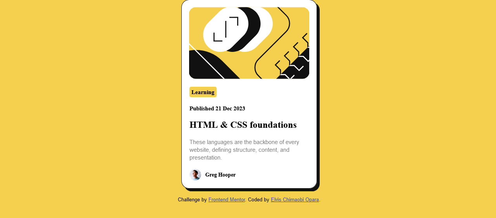

# frontend-mentor-challenge
My solution
# Frontend Mentor - 

This is a solution to the [Blog preview challenge on Frontend Mentor](https://www.frontendmentor.io/challenges/blog-preview-card-ckPaj01lcs). Frontend Mentor challenges help you improve your coding skills by building realistic projects. 

## Table of contents

- [Overview](#overview)
  - [Screenshot](#screenshot)
  - [Links](#links)
- [My process](#my-process)
  - [Built with](#built-with)
  - [Continued development](#continued-development)
- [Author](#author).

## Overview

### Screenshot

### Links

- Solution URL: [Add solution URL here](https://your-solution-url.com)
- Live Site URL: [Add live site URL here](https://frontend-mentor-challenge-indol.vercel.app)

## My process

### Built with

- Semantic HTML5 markup
- CSS custom properties
- Flexbox

### Continued development

I'm hoping to get better with my css skills. I'm always open to learning

## Author

- Frontend Mentor - [@yourusername](https://www.frontendmentor.io/profile/ScarletElvis)
- Twitter - [@yourusername](https://twitter.com/DreamvilleScar)